# Database Schema Documentation

## Entity Relationship Diagram

```mermaid
erDiagram
  %% ======================= AUTH SERVICE (Postgres) =======================
  AUTH_NONCES {
    string   nonce PK
    string   account_id
    string   domain
    string   chain_id
    datetime issued_at
    datetime expires_at
    boolean  used
    datetime used_at
    datetime created_at
  }

  SESSIONS {
    uuid     session_id PK
    uuid     user_id
    uuid     device_id
    string   refresh_hash
    string   previous_refresh_hash
    uuid     token_family_id
    int      token_generation
    inet     ip_address
    string   user_agent
    datetime created_at
    datetime expires_at
    datetime revoked_at
    datetime last_used_at
    string   revoked_reason
    json     collection_intent_context
  }

  LOGIN_EVENTS {
    uuid     id PK
    uuid     user_id
    string   account_id
    inet     ip_address
    string   user_agent
    string   result
    string   error_message
    string   chain_id
    string   domain
    datetime timestamp
  }

  %% ======================= USER SERVICE (Postgres) =======================
  USERS {
    uuid     user_id PK
    string   status
    datetime created_at
    datetime updated_at
  }

  PROFILES {
    uuid     user_id PK
    string   username
    string   display_name
    string   avatar_url
    string   banner_url
    string   bio
    string   locale
    string   timezone
    json     socials_json
    datetime updated_at
  }

  USER_PREFERENCES {
    uuid     user_id PK
    boolean  email_notifications
    boolean  push_notifications
    boolean  marketing_emails
    string   language
    string   currency
    string   theme
    string   privacy_level
    boolean  show_activity
    datetime updated_at
  }

  USER_STATS {
    uuid     user_id PK
    int      collections_count
    int      items_count
    int      listings_count
    int      sales_count
    int      purchases_count
    numeric  volume_sold
    numeric  volume_purchased
    int      followers_count
    int      following_count
    datetime updated_at
  }

  USER_FOLLOWS {
    uuid     follower_id PK
    uuid     following_id PK
    datetime created_at
  }

  %% ======================= WALLET SERVICE (Postgres) =======================
  WALLET_LINKS {
    uuid     wallet_id PK
    uuid     user_id
    string   account_id
    string   address
    string   chain_id
    boolean  is_primary
    string   type
    string   connector
    string   label
    datetime verified_at
    datetime created_at
    datetime updated_at
  }

  WALLET_ACTIVITY {
    uuid     id PK
    uuid     wallet_id
    uuid     user_id
    string   action
    json     metadata
    inet     ip_address
    string   user_agent
    datetime created_at
  }

  WALLET_VERIFICATIONS {
    uuid     id PK
    uuid     wallet_id
    string   verification_type
    json     verification_data
    string   status
    datetime verified_at
    datetime expires_at
    datetime created_at
  }

  %% ======================= CHAIN REGISTRY (Postgres) =======================
  CHAINS {
    int      id PK
    string   caip2
    int      chain_numeric
    string   name
    string   native_symbol
    int      decimals
    string   explorer_url
    boolean  enabled
    json     features_json
  }

  CHAIN_ENDPOINTS {
    int      id PK
    int      chain_id
    string   url
    int      priority
    int      weight
    string   auth_type
    int      rate_limit
    boolean  active
  }

  CHAIN_CONTRACTS {
    int      id PK
    int      chain_id
    string   name
    string   address
    int      start_block
    datetime verified_at
  }

  CHAIN_GAS_POLICY {
    int      chain_id PK
    float    max_fee_gwei
    float    priority_fee_gwei
    float    multiplier
    float    last_observed_base_fee_gwei
    datetime updated_at
  }

  %% ======================= ORCHESTRATOR (Postgres) =======================
  TX_INTENTS {
    uuid     intent_id PK
    string   kind
    string   chain_id
    string   preview_address
    string   tx_hash
    string   status
    uuid     created_by
    json     req_payload_json
    string   error
    datetime deadline_at
    datetime created_at
    datetime updated_at
  }

  %% ======================= CATALOG (Postgres) =======================
  COLLECTIONS {
    uuid     id PK
    uuid     user_id FK
    string   slug
    string   name
    string   symbol
    string   description
    string   category
    string   contract_address
    string   chain_id
    string   token_standard
    string   deployer_address
    string   status
    datetime deployed_at
    string   index_status
    int      deployed_block
    string   base_uri
    bigint   max_supply
    numeric  mint_price_allowlist
    numeric  mint_price_public
    datetime mint_start_time
    datetime allowlist_stage_end
    int      mint_limit_per_wallet
    int      royalty_fee_bps
    string   royalty_recipient
    int      total_supply
    int      total_minted
    string   image_url
    string   banner_url
    string   featured_image_url
    string   website_url
    json     social_links_json
    boolean  is_verified
    boolean  is_hidden
    string   source
    string   metadata_standard
    json     tags_json
    json     settings_json
    datetime created_at
    datetime updated_at
  }

  COLLECTION_METADATA {
    uuid     id PK
    uuid     collection_id FK
    string   metadata_uri
    string   ipfs_hash
    string   ipfs_url
    string   discord_url
    string   twitter_url
    string   instagram_url
    string   medium_url
    string   telegram_url
    string   background_color
    datetime created_at
    datetime updated_at
  }

  COLLECTION_ACTIVITY {
    uuid     id PK
    uuid     collection_id FK
    uuid     user_id FK
    string   activity_type
    json     details
    inet     ip_address
    string   user_agent
    datetime created_at
  }

  COLLECTION_ALLOWLIST {
    uuid     id PK
    uuid     collection_id FK
    string   wallet_address
    int      max_mint_amount
    uuid     added_by_user_id FK
    datetime added_at
    datetime created_at
  }

  COLLECTION_STATS {
    uuid     collection_id PK
    int      total_items
    int      total_owners
    int      total_sales
    numeric  floor_price_wei
    numeric  total_volume_wei
    numeric  average_price_wei
    numeric  volume_24h_wei
    int      sales_24h
    datetime last_sale_at
    datetime last_mint_at
    datetime updated_at
  }

  COLLECTION_ROLES {
    string   chain_id
    string   address
    string   role
    string   account
    datetime granted_at
  }

  COLLECTION_BINDINGS {
    uuid     id PK
    uuid     collection_id
    string   chain_id
    string   family
    string   token_standard
    string   contract_address
    string   mint_authority
    string   inscription_id
    boolean  is_primary
  }

  COLLECTION_MINT_CONFIG {
    uuid     collection_id PK
    datetime start_date
    datetime end_date
    string   mint_price_text
  }

  TOKENS {
    uuid     id PK
    uuid     collection_id
    string   chain_id
    string   family
    string   contract_address
    string   mint_address
    string   inscription_id
    string   token_number
    string   token_standard
    int      supply
    boolean  burned
    string   name
    string   image_url
    string   metadata_url
    string   owner_address
    int      minted_block
    datetime minted_at
    datetime last_refresh_at
    string   metadata_doc
  }

  TRAITS {
    uuid     id PK
    uuid     collection_id
    string   name
    string   normalized_name
    string   value_type
    string   display_type
    string   unit
    int      sort_order
  }

  TRAIT_VALUES {
    uuid     id PK
    uuid     trait_id
    string   value_type
    string   value_string
    float    value_number
    bigint   value_epoch_seconds
    string   normalized_value
    int      occurrences
    float    frequency
    float    rarity_score
    float    max_value
    string   unit
  }

  TOKEN_TRAIT_LINKS {
    uuid     token_id
    uuid     trait_id
    uuid     trait_value_id
  }

  TOKEN_BALANCES {
    string   chain_id
    string   contract
    string   token_id
    string   owner
    numeric  quantity
    datetime updated_at
  }

  OWNERSHIP_TRANSFERS {
    string   chain_id
    string   contract
    string   token_id
    string   from_addr
    string   to_addr
    string   tx_hash
    int      log_index
    datetime at
  }

  NFT_FLAGS {
    string   chain_id
    string   contract
    string   token_id
    boolean  is_flagged
    boolean  is_spam
    boolean  is_frozen
    boolean  is_nsfw
    boolean  refreshable
    json     reason_json
    datetime updated_at
  }

  MARKETPLACES {
    uuid     id PK
    string   name
  }

  LISTINGS {
    uuid     id PK
    uuid     token_id
    uuid     marketplace_id
    numeric  price_native
    string   price_native_text
    string   currency_symbol
    boolean  is_active
    datetime listed_at
    datetime updated_at
    string   seller_address
    datetime expires_at
    string   url
    string   tx_hash
  }

  OFFERS {
    uuid     id PK
    uuid     token_id
    uuid     marketplace_id
    numeric  price_native
    string   price_native_text
    string   currency_symbol
    string   from_address
    datetime created_at
    datetime expires_at
    string   tx_hash
  }

  SALES {
    uuid     id PK
    uuid     token_id
    uuid     marketplace_id
    numeric  price_native
    string   price_native_text
    string   currency_symbol
    string   tx_hash
    datetime occurred_at
  }

  ORDERS {
    uuid     id PK
    uuid     token_id
    string   side
    string   maker
    string   taker
    numeric  price_native
    string   currency_symbol
    datetime start_at
    datetime end_at
    string   signature
    string   salt
    string   source_marketplace
    string   status
    datetime updated_at
  }

  ORDER_FILLS {
    uuid     id PK
    uuid     order_id
    string   tx_hash
    numeric  price_native
    datetime filled_at
  }

  COLLECTION_STATS {
    uuid     collection_id PK
    int      items_count
    int      owners_count
    numeric  floor_price_native
    string   floor_currency_symbol
    numeric  market_cap_est
    datetime last_updated_at
  }

  TOKEN_RARITY {
    uuid     token_id PK
    float    rarity_score_product
  }

  RARITY_SCORES {
    uuid     token_id
    string   method
    string   source
    float    score
    int      rank
    datetime updated_at
  }

  TRAIT_VALUE_FLOOR {
    uuid     trait_value_id PK
    numeric  floor_price_native
    datetime last_updated_at
  }

  ACTIVITIES {
    uuid     id PK
    uuid     token_id
    string   type
    string   from_address
    string   to_address
    numeric  price_native
    string   price_native_text
    string   currency_symbol
    string   tx_hash
    string   block_or_slot
    datetime timestamp
    string   marketplace
  }

  SYNC_STATE {
    uuid     id PK
    uuid     collection_id
    string   source
    string   cursor
    datetime last_run_at
    string   note
  }

  PROCESSED_EVENTS {
    string   event_id PK
    int      event_version
    string   chain_id
    string   block_hash
    int      log_index
    datetime processed_at
  }

  %% ======================= RELATIONSHIPS =======================

  %% Auth/User
  USERS ||--o{ SESSIONS : "has sessions"
  USERS ||--o{ LOGIN_EVENTS : "login history"

  %% User/Profile
  USERS ||--|| PROFILES : "owns profile"
  USERS ||--|| USER_PREFERENCES : "has preferences"
  USERS ||--|| USER_STATS : "has stats"
  USERS ||--o{ USER_FOLLOWS : "follows"
  USERS ||--o{ USER_FOLLOWS : "followed by"

  %% Wallet/User
  USERS ||--o{ WALLET_LINKS : "has wallets"
  WALLET_LINKS ||--o{ WALLET_ACTIVITY : "activity log"
  WALLET_LINKS ||--o{ WALLET_VERIFICATIONS : "verifications"

  %% Chain Registry
  CHAINS ||--o{ CHAIN_ENDPOINTS : "has endpoints"
  CHAINS ||--o{ CHAIN_CONTRACTS : "has contracts"
  CHAINS ||--|| CHAIN_GAS_POLICY : "has gas policy"

  %% Catalog Domain
  USERS ||--o{ COLLECTIONS : "owns collections"
  COLLECTIONS ||--|| COLLECTION_METADATA : "has metadata"
  COLLECTIONS ||--o{ COLLECTION_ACTIVITY : "activity log"
  COLLECTIONS ||--o{ COLLECTION_ALLOWLIST : "allowlist"
  COLLECTIONS ||--o{ COLLECTION_ROLES : "roles"
  COLLECTIONS ||--o{ COLLECTION_BINDINGS : "bindings"
  COLLECTIONS ||--o{ COLLECTION_MINT_CONFIG : "mint config"
  COLLECTIONS ||--o{ TOKENS : "contains"
  COLLECTIONS ||--o{ TRAITS : "has traits"
  COLLECTIONS ||--|| COLLECTION_STATS : "has stats"
  COLLECTIONS ||--o{ SYNC_STATE : "sync state"
  USERS ||--o{ COLLECTION_ACTIVITY : "collection actions"
  USERS ||--o{ COLLECTION_ALLOWLIST : "added to allowlist"

  TRAITS ||--o{ TRAIT_VALUES : "has values"
  TOKENS ||--o{ TOKEN_TRAIT_LINKS : "has traits"
  TRAITS ||--o{ TOKEN_TRAIT_LINKS : "trait link"
  TRAIT_VALUES ||--o{ TOKEN_TRAIT_LINKS : "value link"
  TRAIT_VALUES ||--|| TRAIT_VALUE_FLOOR : "floor price"

  MARKETPLACES ||--o{ LISTINGS : "has listings"
  MARKETPLACES ||--o{ OFFERS : "has offers"
  MARKETPLACES ||--o{ SALES : "has sales"

  TOKENS ||--o{ LISTINGS : "listings"
  TOKENS ||--o{ OFFERS : "offers"
  TOKENS ||--o{ SALES : "sales"
  TOKENS ||--o{ ACTIVITIES : "activities"
  TOKENS ||--o{ TOKEN_BALANCES : "balances"
  TOKENS ||--o{ OWNERSHIP_TRANSFERS : "transfers"
  TOKENS ||--|| NFT_FLAGS : "flags"
  TOKENS ||--|| TOKEN_RARITY : "rarity"
  TOKENS ||--o{ ORDERS : "orders"

  ORDERS ||--o{ ORDER_FILLS : "fills"

  PROCESSED_EVENTS ||..|| LISTINGS : "guard"
  PROCESSED_EVENTS ||..|| OFFERS : "guard"
  PROCESSED_EVENTS ||..|| SALES : "guard"
  PROCESSED_EVENTS ||..|| TOKENS : "guard"
```

## Database Distribution

### PostgreSQL Database (Single DB)
All tables are stored in a single PostgreSQL database:

#### ✅ Currently Implemented (16 tables)

**Auth Service Tables (3):**
- `auth_nonces`: One-time nonces for SIWE authentication (10-minute expiration)
- `sessions`: JWT session management with token rotation and family tracking
- `login_events`: Audit log of authentication attempts

**User Service Tables (5):**
- `users`: Core user accounts (UUID-based, status tracking)
- `profiles`: User profiles (username, bio, avatar, social links)
- `user_preferences`: User settings (theme, notifications, privacy)
- `user_stats`: Aggregated user statistics (followers, items, volume, **collections**)
- `user_follows`: Social graph relationships

**Wallet Service Tables (3):**
- `wallet_links`: User-wallet associations (CAIP-10 format, multi-chain support)
- `wallet_activity`: Audit log of wallet operations
- `wallet_verifications`: Wallet ownership verification records

**Collection Service Tables (5):** ✨ NEW
- `collections`: NFT collection records with lifecycle tracking (PENDING → DEPLOYED)
- `collection_metadata`: IPFS links, social media, external URLs
- `collection_stats`: Aggregated statistics (floor price, volume, owners)
- `collection_activity`: Audit log of collection activities
- `collection_allowlist`: Whitelist addresses for allowlist minting stage

#### 🚧 Future Features (Planned but not yet implemented)

**Chain Registry Tables (4):**
- `chains`: Blockchain network configurations (name, chainId, RPC, explorer)
- `chain_endpoints`: RPC endpoint management with priority/weight balancing
- `chain_contracts`: Deployed contract addresses and verification status
- `chain_gas_policy`: Gas pricing strategies per chain

**Orchestrator Tables (1):**
- `tx_intents`: Transaction intent management and execution tracking

**Catalog/NFT Domain Tables (25+):**
- `collection_roles`: Role-based access control for collections
- `collection_bindings`: Multi-chain contract bindings
- `collection_mint_config`: Advanced mint campaign configuration
- `tokens`: NFT token metadata and ownership (ERC721/ERC1155)
- `traits`: Collection trait definitions
- `trait_values`: Trait value enumeration with rarity
- `token_trait_links`: Token-to-trait associations
- `token_balances`: Current token ownership (ERC1155 support)
- `ownership_transfers`: Token transfer history
- `nft_flags`: Token flags (spam, NSFW, frozen)
- `marketplaces`: Marketplace integrations
- `listings`: Active marketplace listings
- `offers`: Offers on tokens
- `sales`: Historical sales data
- `orders`: Off-chain order book
- `order_fills`: Order execution history
- `token_rarity`: Token rarity scores
- `rarity_scores`: Multi-source rarity rankings
- `trait_value_floor`: Floor price by trait value
- `activities`: Unified activity feed
- `sync_state`: External API sync cursors
- `processed_events`: Idempotency tracking for blockchain events

### Key Database Features (Currently Implemented)

**Triggers:**
- `create_user_defaults`: Automatically creates profile, preferences, and stats on user creation
- `ensure_single_primary`: Ensures only one primary wallet per user
- `update_follow_stats`: Updates follower/following counts automatically
- `log_wallet_changes`: Auto-logs wallet link/unlink/update activities
- `create_collection_defaults`: Auto-creates collection_stats record on collection creation ✨ NEW
- `increment_user_collections_count`: Updates user_stats.collections_count on insert ✨ NEW
- `decrement_user_collections_count`: Updates user_stats.collections_count on delete ✨ NEW
- `log_collection_activity`: Auto-logs collection CREATED and STATUS_CHANGED activities ✨ NEW
- `update_collection_updated_at`: Auto-updates collections.updated_at timestamp ✨ NEW

**Functions:**
- `cleanup_expired_nonces()`: Removes expired nonces (1 hour retention)
- `cleanup_old_login_events(retention_days)`: Cleans old login events (90 days default)
- `cleanup_expired_sessions()`: Revokes expired sessions
- `try_use_nonce(nonce, account, chain, domain)`: Atomically marks nonce as used
- `cleanup_pending_collections()`: Removes collections stuck in PENDING > 24h ✨ NEW

**Constraints:**
- CAIP-10 account ID format validation (`eip155:chainId:0xaddress`)
- Username format validation (3-30 alphanumeric + underscore)
- Bio length limit (500 chars)
- Non-negative stats enforcement
- Session/nonce expiry validation

## Service Architecture

This schema supports a **microservices architecture** with three core services communicating via gRPC:

**Currently Running:**
1. **Auth Service** (gRPC :50051): SIWE authentication, session management
2. **User Service** (gRPC :50052): User profiles, preferences, social features
3. **Wallet Service** (gRPC :50053): Wallet linking, verification
4. **GraphQL Gateway** (HTTP :8081): BFF API layer

All services share a single PostgreSQL database but maintain strict service boundaries through the repository pattern.

## Related Services (Separate Databases)

These services have their own databases and are **NOT included** in this schema:

- **zuno-marketplace-indexer**: Blockchain event indexing (uses Ponder with `event` and `account` tables only)
- **zuno-marketplace-metadata**: NFT metadata management (separate Postgres with `metadata`, `media`, `api_key` tables)
- **zuno-marketplace-abis**: ABI marketplace (separate Postgres with `abis`, `contracts`, `networks` tables)
- **zuno-marketplace-notifications**: Multi-channel notifications (separate Postgres with `notifications`, `templates` tables)
- **zuno-marketplace-event-stream**: Real-time event widget (stateless, no database)

## Tables Removed from Schema

The following tables were removed as they belong to separate services:

- ❌ `INDEXER_CHECKPOINTS`, `EVENTS_RAW` - Indexer uses Ponder, not these tables
- ❌ `METADATA_DOCS`, `MEDIA_ASSETS`, `MEDIA_VARIANTS` - Managed by metadata service
- ❌ `APPROVALS`, `APPROVALS_HISTORY` - Should be tracked by indexer service, not API
- ❌ `WALLETS` - Renamed to `wallet_links` in current implementation
